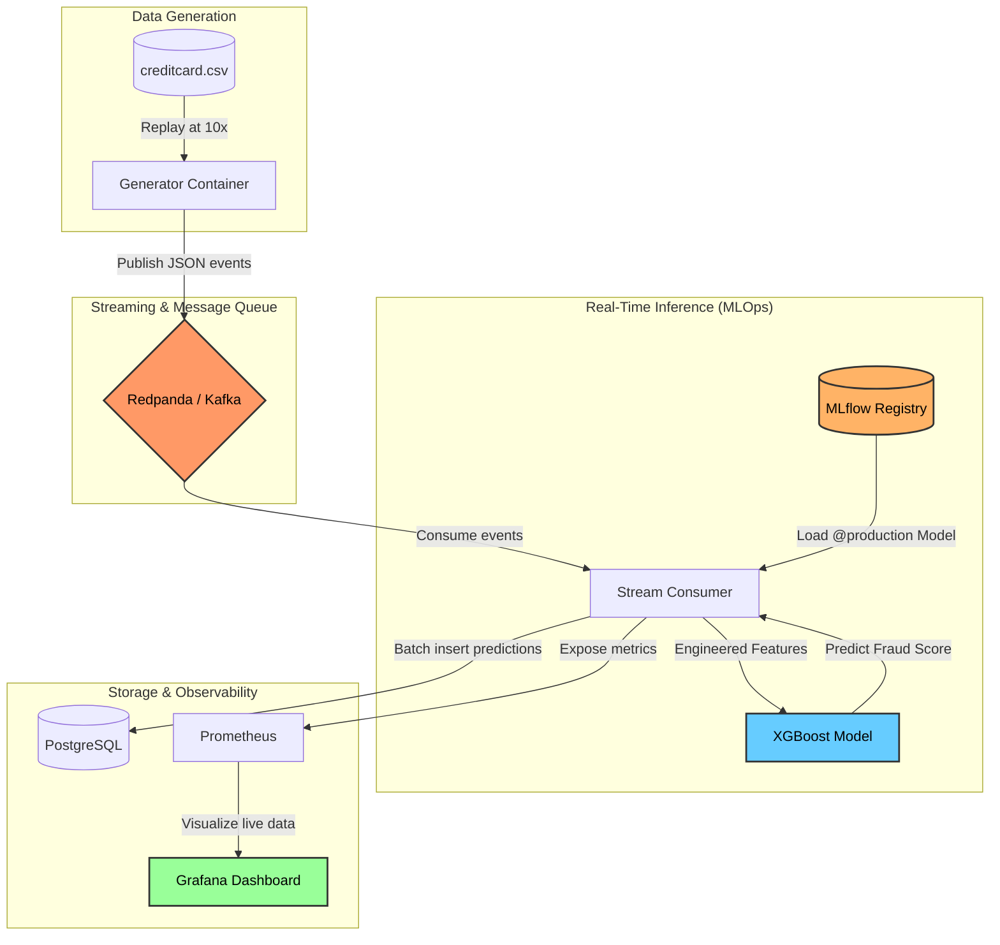
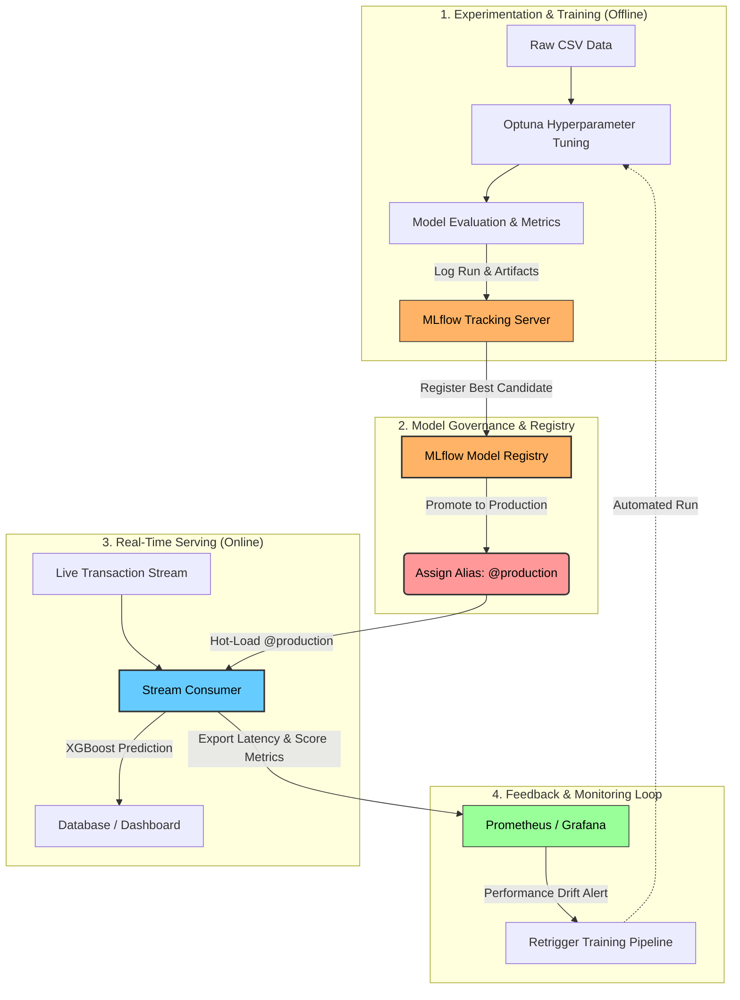

# 🛡️ Real-Time Fraud Detection Streaming Pipeline & MLOps

[](https://www.python.org/)
[](https://www.docker.com/)
[](https://redpanda.com/)
[](https://mlflow.org/)
[](https://www.postgresql.org/)
[](https://prometheus.io/)
[](https://grafana.com/)
[](https://opensource.org/licenses/MIT)

An **End-to-End** ultra-low latency architecture for credit card fraud detection. This project bridges the worlds of **Real-Time Data Engineering** and **MLOps** to demonstrate how to train, promote, serve, and monitor a machine learning model in production with zero training-serving skew.

---

## 📐 System Architecture

The infrastructure is fully containerized and structured as a continuous feedback loop:



### 🔁 MLOps Lifecycle

In addition to data flow, the system enforces a strict MLOps lifecycle dividing offline experimentation, governance, and online inference:



---

## ✨ Key Features

* **🚀 Zero Training-Serving Skew**: Calculation of historical sliding window features (*rolling amount z-score*, *time gap*, *rolling count*) synchronized to simulated event time to ensure exact equivalence between offline training and live stream.
* **🧠 Advanced Optuna Training**: XGBoost training pipeline with automated hyperparameter search (50 trials, 3-fold CV) specifically optimized for **Area Under Precision-Recall Curve (AUC-PR)** on highly imbalanced data (0.17% frauds).
* **🗃️ Model Registry with Aliases**: Utilization of the modern MLflow `@production` system to promote and hot-serve models without downtime or consumer restarts.
* **📉 High-Performance Batch Writes**: The consumer accumulates predictions in memory and micro-batches them to PostgreSQL (every 50 records or 5 seconds) to maximize database throughput.
* **📊 Enterprise-Grade Observability**: Real-time monitoring of throughput, inference latency (averaging **~4ms**), consumer lag, and anomaly score via Prometheus and Grafana.
* **🛡️ 100% Test Coverage**: 24 unit and equivalence tests run continuously via CI.

---

## 🛠️ Tech Stack

* **Data Stream**: Redpanda (Kafka v3 compatible) + Redpanda Console
* **Machine Learning**: XGBoost, Scikit-learn, Optuna (Tuning), SHAP (Interpretability)
* **MLOps**: MLflow 2.15 (Tracking & Registry)
* **Database**: PostgreSQL (Historical sink)
* **Metrics**: Prometheus & Grafana

---

## ⏱️ Quick Start

### 1. Prerequisites
Make sure you have installed:
* Docker & Docker Compose
* Python 3.11 or 3.12 (for local training)

### 2. Dataset Download
Download the [Credit Card Fraud Detection](https://www.kaggle.com/datasets/mlg-ulb/creditcardfraud) dataset from Kaggle and place the `creditcard.csv` file in the `data/` folder:
```bash
# Expected structure:
# data/creditcard.csv
```

### 3. Training & Model Registration
Start the initial databases, install local requirements, and launch the training (Optuna optimization will take about 5-10 minutes depending on the CPU):
```bash
# Start Postgres and MLflow
docker compose up -d postgres mlflow

# Install local requirements
pip install -r training/requirements.txt

# Start training (Optuna -> Model Registration)
cd training && python3 train.py
```
*The winning model will be saved on MLflow and automatically promoted with the `@production` alias.*

### 4. Start Streaming Pipeline
```bash
# Return to the main folder
cd ..

# Copy the env config file
cp .env.example .env

# Start the entire pipeline
make up
```

### 5. Explore Live Dashboards
* **Grafana (Charts & Metrics)**: [http://localhost:3000](http://localhost:3000) (Credentials: `admin` / `admin`)
* **MLflow UI (Model Tracking)**: [http://localhost:5000](http://localhost:5000)
* **Redpanda Console (Kafka Messages)**: [http://localhost:8080](http://localhost:8080)

---

## 📂 Project Structure

```text
├── generator/          # Kafka producer — reads CSV and simulates events
├── consumer/           # Kafka consumer — feature engineering + XGBoost inference + DB writing
├── training/           # Local ML Pipeline (train.py, evaluate.py, baseline.py)
├── monitoring/         # Prometheus configs & Grafana JSON dashboards
├── db/                 # PostgreSQL initialization SQL scripts
├── tests/              # Pytest unit and equivalence tests
└── docker-compose.yml  # Infrastructure definition (8 containers)
```

---

## 📜 Useful Commands (Makefile)

The project includes a `Makefile` to simplify daily management:
```bash
make up         # Start the entire pipeline in background
make down       # Stop and remove all containers
make logs       # View logs of all services in real time
make logs-consumer # Specifically follow the inference consumer logs
make test       # Run all 24 local unit tests
make clean      # Remove all containers, cache, and Docker volumes (hard reset)
make urls       # Print the list of all active dashboard URLs
```

---

## 🎓 Academic Contribution

This project is ideal as a foundation or case study for theses in **Data Science, Cloud Computing, and Software Engineering**. It demonstrates the practical implementation of:
1. **Latency and Efficiency**: Measuring inference metrics and database buffering.
2. **Imbalanced Classes**: Handling real-world datasets with <0.2% fraud using gradient weighting (`scale_pos_weight`) and Area Under Precision-Recall curve.
3. **Software Robustness**: Service isolation via containers, automated testing in CI, and resilience to single-component crashes.

---

## 📄 License

Distributed under the MIT License. See `LICENSE` for more information.
