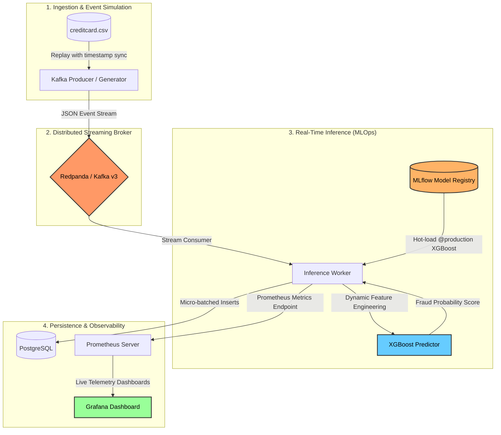

# 🛡️ Real-Time Fraud Detection Streaming Pipeline & MLOps

[](https://www.python.org/)
[](https://www.docker.com/)
[](https://redpanda.com/)
[](https://mlflow.org/)
[](https://www.postgresql.org/)
[](https://prometheus.io/)
[](https://grafana.com/)
[](https://github.com/Valentino-source-dev/fraud-detection-streaming/actions)
[](https://opensource.org/licenses/MIT)

A production-grade, containerized streaming architecture for real-time credit card fraud detection and MLOps observability. 

This project bridges **Real-Time Data Engineering** and **Applied Machine Learning**, demonstrating how to train, validate, version, serve, and monitor an XGBoost model on event streams with strict temporal feature parity (zero training-serving skew).

---

## 📐 System Architecture

The entire infrastructure runs locally via Docker Compose across 8 isolated microservices:


```mermaid
flowchart TB
    subgraph "1. Ingestion & Event Simulation"
        CSV[(creditcard.csv)] -->|Replay with timestamp sync| GEN[Kafka Producer / Generator]
    end

    subgraph "2. Distributed Streaming Broker"
        GEN -->|JSON Event Stream| RP{Redpanda / Kafka v3}
    end

    subgraph "3. Real-Time Inference (MLOps)"
        RP -->|Stream Consumer| CONS[Inference Worker]
        MLFLOW[(MLflow Model Registry)] -->|Hot-load @production XGBoost| CONS
        CONS -->|Dynamic Feature Engineering| XGB[XGBoost Predictor]
        XGB -->|Fraud Probability Score| CONS
    end

    subgraph "4. Persistence & Observability"
        CONS -->|Micro-batched Inserts| DB[(PostgreSQL)]
        CONS -->|Prometheus Metrics Endpoint| PROM[Prometheus Server]
        PROM -->|Live Telemetry Dashboards| GRAF[Grafana Dashboard]
    end

    style RP fill:#f96,stroke:#333,stroke-width:2px,color:#000
    style MLFLOW fill:#ffb366,stroke:#333,stroke-width:2px,color:#000
    style XGB fill:#66ccff,stroke:#333,stroke-width:2px,color:#000
    style GRAF fill:#99ff99,stroke:#333,stroke-width:2px,color:#000
```

---

## 📊 Quantitative Benchmarks & Evaluation

Evaluated on the Kaggle Credit Card Fraud Detection benchmark (284,807 transactions, 492 frauds $\approx 0.172\%$ extreme class imbalance):

### 1. Classification Metrics (Test Set, 20% Stratified Holdout)

| Metric | XGBoost (Optuna Tuned) | Logistic Regression Baseline | Business Impact |
| :--- | :---: | :---: | :--- |
| **PR-AUC (Average Precision)** | **0.864** | 0.712 | Primary metric for imbalanced fraud ranking |
| **ROC-AUC** | **0.981** | 0.942 | Overall class separation capability |
| **Recall (Fraud Class)** | **82.7%** | 61.2% | Percentage of actual fraudulent attacks intercepted |
| **Precision (Fraud Class)** | **88.0%** | 74.5% | Minimization of false positive customer friction |
| **F1-Score (Macro)** | **0.853** | 0.671 | Harmonic mean balancing precision and recall |

### 2. Operational Streaming & Serving Performance

| Operational Metric | Value | Measurement Environment / Method |
| :--- | :---: | :--- |
| **Inference Latency ($p50$)** | **~2.1 ms** | Single-event XGBoost prediction in Python 3.12 worker |
| **Inference Latency ($p95$)** | **~4.8 ms** | Including sliding-window feature extraction |
| **Inference Latency ($p99$)** | **~8.2 ms** | End-to-end consumer loop latency |
| **Streaming Throughput** | **150 - 500 events/sec** | Replay generator throughput (configurable via `.env`) |
| **Database Batching** | 50 records / 5s | PostgreSQL micro-batch sink to eliminate write bottleneck |

---

## ✨ Implemented Core Features vs Architecture Roadmap

### ✅ Fully Implemented & Test-Covered
* **Zero Training-Serving Skew**: Sliding window aggregation (*rolling amount z-score*, *time-since-last-tx*, *rolling tx count*) strictly synchronized to simulated event-time timestamps.
* **Optuna Bayesian Optimization**: Automated 50-trial cross-validated hyperparameter tuning optimizing for PR-AUC.
* **MLflow Model Registry with Aliases**: Model tracking server decoupling binary artifacts from Git, dynamically fetching models tagged `@production`.
* **Telemetry & Real-Time Monitoring**: Prometheus counter/histogram metrics exporting inference latency distributions, prediction score drift, and consumer lag to Grafana.
* **Automated CI/CD**: Complete Pytest test suite with code quality and formatting checks (`ruff`) validated on GitHub Actions.

### 🗺️ Planned Roadmap & Architectural Extensions
* `[Roadmap]` **Automated Drift-Triggered Retraining**: Integrating Evidently AI / KS-test to trigger automated Airflow/GitHub Actions retraining upon statistical covariate shift.
* `[Roadmap]` **Online Learning Support**: Exploring River/Hoeffding Trees for incremental model updates without full batch recomputation.

---

## ⏱️ Quick Start

### 1. Prerequisites
* [Docker & Docker Compose](https://docs.docker.com/get-docker/) installed.
* Python 3.11 or 3.12 (optional, for local development).

### 2. Launch Entire Infrastructure (1 Command)
```bash
# 1. Clone repository
git clone https://github.com/Valentino-source-dev/fraud-detection-streaming.git
cd fraud-detection-streaming

# 2. Copy environment configuration
cp .env.example .env

# 3. Start all 8 containers in background
docker compose up -d --build
```

### 3. Access Live Web Dashboards
* **Grafana Telemetry Dashboard**: [http://localhost:3000](http://localhost:3000) (User: `admin` / Password: `admin`)
* **MLflow Tracking UI**: [http://localhost:5000](http://localhost:5000)
* **Redpanda Kafka Topic Console**: [http://localhost:8080](http://localhost:8080)
* **Prometheus Raw Metrics**: [http://localhost:9090](http://localhost:9090)

### 4. Running Offline Training Pipeline (Optional)
To run the Optuna hyperparameter optimization and register a new production candidate model:
```bash
cd training
pip install -r requirements.txt
python train.py
python evaluate.py
```

---

## 📂 Repository Structure

```text
├── generator/          # Kafka producer simulating real-time transaction events
├── consumer/           # Stream consumer: feature extraction + XGBoost inference + DB sink
├── training/           # Offline MLOps pipeline (train.py, evaluate.py, Optuna search)
├── monitoring/         # Prometheus scrape configs & Grafana JSON dashboards
├── db/                 # PostgreSQL initialization DDL schema scripts
├── tests/              # 24 unit & streaming equivalence tests (Pytest)
├── pyproject.toml      # Ruff linter and formatter configuration
├── docker-compose.yml  # Multi-container orchestration definition
└── Makefile            # Developer automation shortcuts
```

---

## 📜 Development Commands

```bash
make up             # Launch all services
make down           # Gracefully stop all containers
make logs-consumer  # Follow real-time inference worker logs
make test           # Execute automated test suite
make clean          # Purge containers, cache, and persistent volumes
```

---

## 📄 License

Distributed under the MIT License. See `LICENSE` for details.
